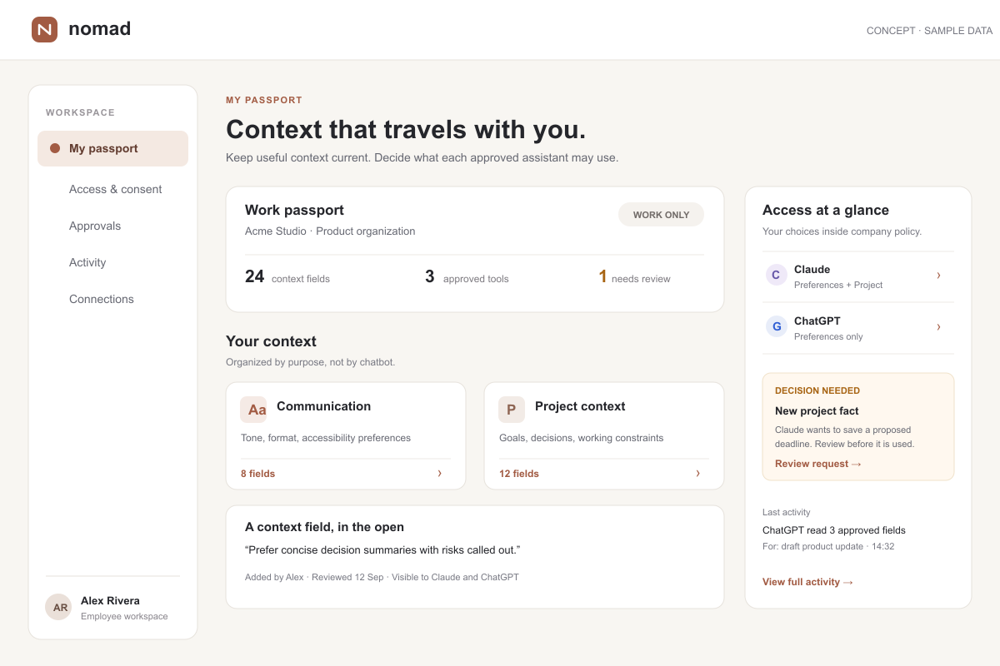
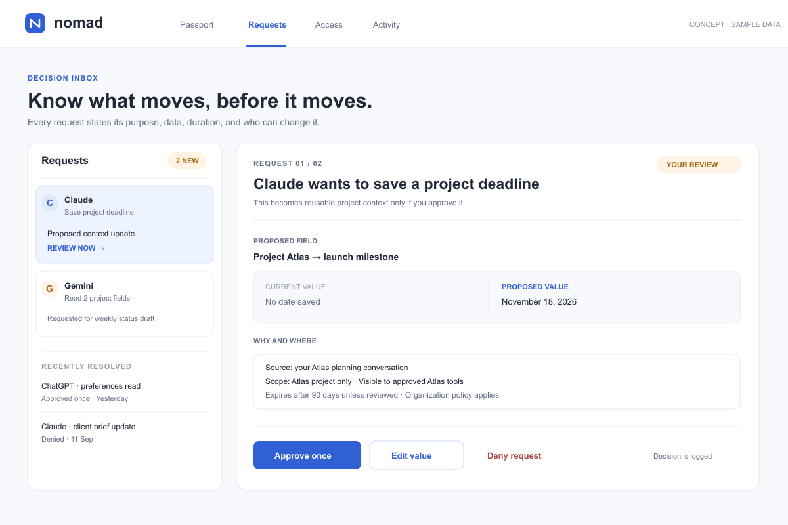
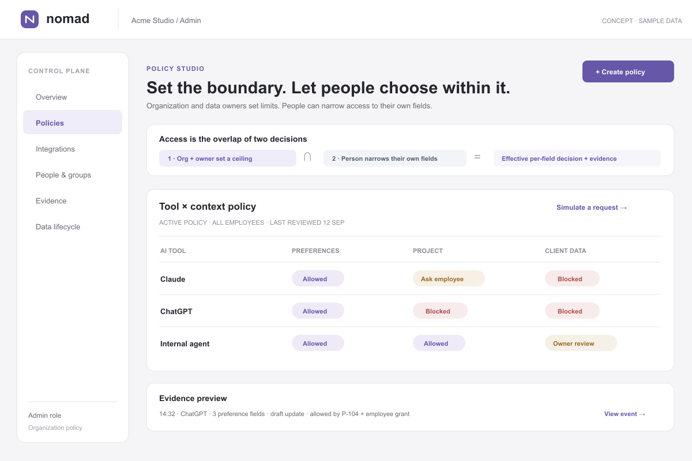

# Light interface concepts for Nomad

**Status:** static mockups for selection. They use fictional sample data and are not a functional application. The prior dark/green prototype remains only as a historical exploration; it is not the proposed visual direction.

## A — Calm Passport

Warm paper surfaces and a restrained clay accent. The employee sees their passport, field provenance, tool access, and a pending request in one view. This is the strongest direction if the primary product promise is understandable, personal control of context. Risk: enterprise policy operations need a separate admin experience.

## B — Decision Inbox

Cool white surfaces and a restrained blue accent. The central task is to make a safe decision: what a tool wants, current versus proposed value, source, scope, expiration, and approve/edit/deny actions. This is the strongest direction if consent is the wedge. Risk: the overall passport may feel secondary.

## C — Policy Studio

White and mist surfaces with restrained violet. The admin view makes the dual-control model explicit: organization maximum policy intersected with an individual's narrower choice. This is the strongest direction for enterprise buyer demonstrations. Risk: it feels less personal and requires careful simplification for daily employees.

## What should not be decided yet

The mockups do not establish the final brand, exact font, mobile flow, terminology, or production frontend stack. Choosing one identifies the primary visual and interaction direction. The chosen concept should then be tested on real approval, revocation, and context-correction tasks before implementation is locked.

## Selection question

Which first experience should define Nomad: **A (your context)**, **B (your decisions)**, or **C (organization policy)**? The production application should not be built until that choice and the first customer workflow are confirmed.
